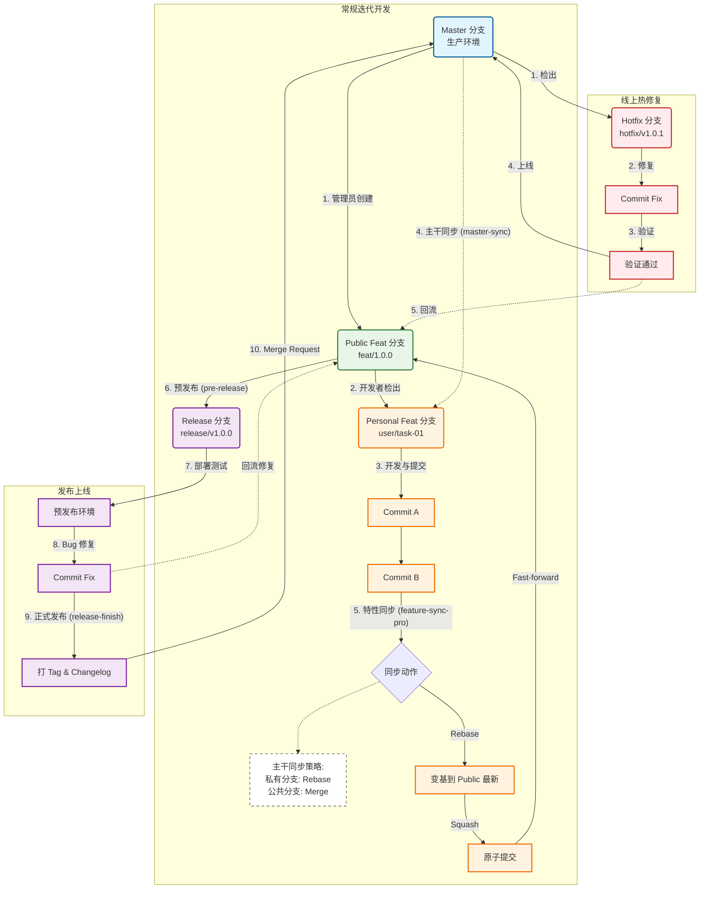

```mermaid
graph TD
    %% 样式定义
    classDef master fill:#e1f5fe,stroke:#01579b,stroke-width:2px;
    classDef feature fill:#e8f5e9,stroke:#2e7d32,stroke-width:2px;
    classDef personal fill:#fff3e0,stroke:#ef6c00,stroke-width:2px;
    classDef release fill:#f3e5f5,stroke:#7b1fa2,stroke-width:2px;
    classDef hotfix fill:#ffebee,stroke:#c62828,stroke-width:2px;
    classDef action fill:#fff,stroke:#333,stroke-dasharray: 5 5;

    %% 主干与分支
    Master("Master 分支<br/>生产环境"):::master
    PublicFeat("Public Feat 分支<br/>feat/1.0.0"):::feature
    PersonalFeat("Personal Feat 分支<br/>user/task-01"):::personal
    ReleaseBranch("Release 分支<br/>release/v1.0.0"):::release
    HotfixBranch("Hotfix 分支<br/>hotfix/v1.0.1"):::hotfix

    %% 1. 迭代开发流程
    subgraph Iteration ["常规迭代开发"]
        direction TB
        Master -->|"1. 管理员创建"| PublicFeat
        PublicFeat -->|"2. 开发者检出"| PersonalFeat
        
        PersonalFeat -->|"3. 开发与提交"| Commit1["Commit A"]:::personal
        Commit1 --> Commit2["Commit B"]:::personal
        
        %% 主干同步
        Master -.->|"4. 主干同步 (master-sync)"| PersonalFeat
        Note1["主干同步策略:<br/>私有分支: Rebase<br/>公共分支: Merge"]:::action
        
        %% 特性同步
        Commit2 -->|"5. 特性同步 (feature-sync-pro)"| SyncAction{"同步动作"}
        SyncAction -->|"Rebase"| RebaseNode["变基到 Public 最新"]:::personal
        RebaseNode -->|"Squash"| AtomicCommit["原子提交"]:::personal
        AtomicCommit -->|"Fast-forward"| PublicFeat
        
        %% 预发布
        PublicFeat -->|"6. 预发布 (pre-release)"| ReleaseBranch
    end

    %% 2. 发布流程
    subgraph Release ["发布上线"]
        direction TB
        ReleaseBranch -->|"7. 部署测试"| PreEnv["预发布环境"]:::release
        PreEnv -->|"8. Bug 修复"| BugFix["Commit Fix"]:::release
        BugFix -->|"9. 正式发布 (release-finish)"| TagVersion["打 Tag & Changelog"]:::release
        TagVersion -->|"10. Merge Request"| Master
        
        %% 回流
        BugFix -.->|"回流修复"| PublicFeat
    end

    %% 3. 热修复流程
    subgraph Hotfix ["线上热修复"]
        direction TB
        Master -->|"1. 检出"| HotfixBranch
        HotfixBranch -->|"2. 修复"| HotfixCommit["Commit Fix"]:::hotfix
        HotfixCommit -->|"3. 验证"| HotfixVerify["验证通过"]:::hotfix
        
        HotfixVerify -->|"4. 上线"| Master
        HotfixVerify -.->|"5. 回流"| PublicFeat
    end

    %% 连接关系
    SyncAction -.-> Note1

```